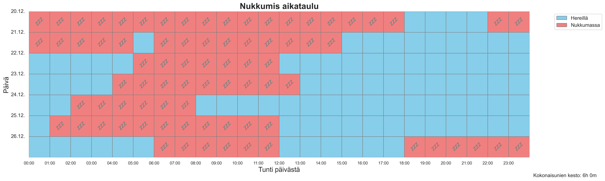
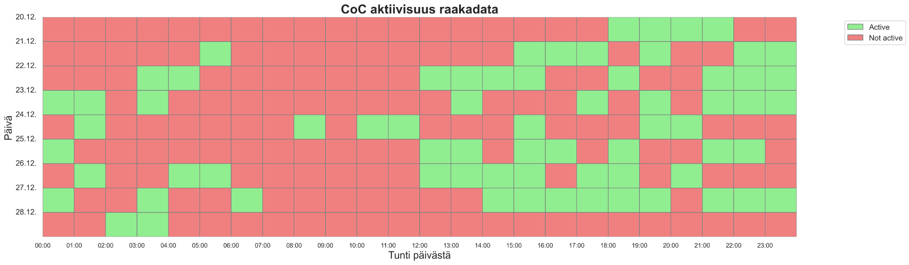

## Clash of Clans (CoC) activity stalker

Inside joke. Stalk my friends sleep schedule based on Clash Of Clans activity. Done with permission. CoC API doesn't give exact activity attributes but work it out from other activities like attacking. Heavy assumptions that the "stalking victim" is heavy duty CoC nerd who plays CoC on every waking hour. However the visualize_data.py forgives some unactive hours. Script (stalker.py) should be ran hourly.

Below is an example visualization generated by visualize_data.py after stalker.py have been collecting data for few days:

visualize_data_raw.py visualizes the raw activity data as it is. Below is an example.

